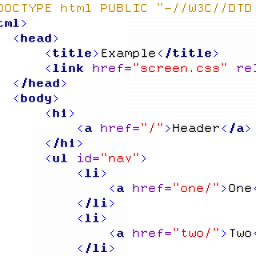
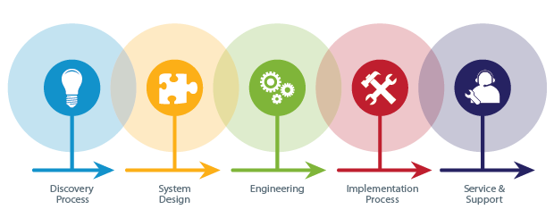

## Structure

Okay time for Code 201, first I read about HTML structure, which are the bones that a website is built upon. 

**Chapter 1 addresses these points:**
- How do people access the web?
- How websites are created
- How the Web works

After reading I thought about screen reader technology and how little I know about it. Say I thought it was just for the sight impaired but it has so many more uses.

### Structure and Formatting Headings
**HTML** uses what are called elements to create the structure of a web page. **Elements** are made up of opening and closing tags and what goes in between them.
# Reading Overview
### Head Element
Contains information about the page including title and link to a .CSS file.

### Body Element
Everything inbetween the opening and closing **Body** tags will display on the page.

I really enjoy how Jon Duckett presents the information in this book. He clearly states concepts and breaks down learning and has helped fill in the gaps of my current HTML knowledge.

# Extra Markup

I must admit having looked at code for many years but not fully understood much of it, I really apprectiate the simplified doctype declaration of HTML 5.

Relating to CSS, ID and Class attributes have been confusing to me and hard to remember when I'm not doing web design all the time.

*Here is my reminder!*

**ID attribute** is known as a global attribute becaus it can be used on *any* element.

**Class Attribute**
Elements can belong to several classes.

**Block Elements**
Always appear to start a new line.

**Divs**
Will never die but it's interesting how Divs have expanded in HTML 5 to become a lot easier to keep track and make sense of. 

**Span**
Something else I've seen for years and not fully understood. 
Span tags are commonly used to control the element using CSS.

**iFrame**
Is great to embed a google map into.
**Seamless**
This tage tells the browser that no scrollbars will be visible with the iframe.

# HTML 5 Layout

I'm actually excited about the layout elements! The labels have sure made it easier to understand.
- Header
- Nav
- Section
- Content
- Article
- Aside
- Footer

**Header groups**
And then there are Fig captions
Multiple heading elements can be grouped as one heading.

**Figure Elements**
Example usages include housing:
- Images
- Videos
- Code Samples
- Graphs
- Diagrams

that go with figures. The tag allows you to create captions.

# Process and Design

This reading asks the questions:

*For and Individual*
- Who is this site for?
- Who is the target audience?
- Age?
- Income?
- How do they access the internet?
- Men or Women?
- Location?

*For a company*
- Comapany size?
- Budget?
- Postions of people that visit the site?
- Why are they visiting?

**Bottom Line:**Why are people visiting your website and what information do they need?

*Wireframing*
The first step in creating a website layout; done by drawing of laying out blocks. 

*Visual Hierarchy*
The order in which your eyes perceive what they see.

Prioritizing and arranging content:

# Javascript Reading

Javascript makes pages more interactive.

Script is a series of instructions for the browser. In designing Javascript code You first must state your goal followed by breaking down the goal into a series of tasks.

## Objects *have*
- Properties
- Events
- Methods
## Events
Script will state events programmer wants to responds to and should run.

## Method
Represents what people need to do with objects. Events can trigger methods. Methods can retrieve or update an object property.

I found the variety of the pre 201 reading interesting and engaging. Some final notes on these readings:

HTML - Content layer

CSS - Presentation layer

JS - Behavior layer

[<== Back to Table of Contents](index.md)