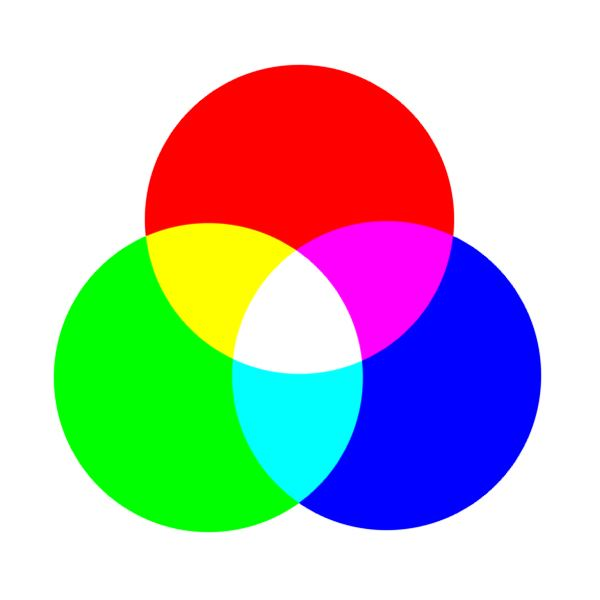

# Reading Day: 05
## Colors

Colors are important on a web page. Visually they help convey the mood and evoke reactions. Color formats that are commonly used are **RGB** which stands for *(Red Green Blue)*. Adjusting the values of all 3 colors differently will produce most of the basic color spectrum. Another format used is called a hex code. Hex codes contain 6 numbers preceded by a #. (#8df44c)

CSS 3 introduced the **RGBA** format. The 'A' from RGBA indicates that the opacity property can be adjusted. HSL was also introduced and stands for **Hue Saturation Lightness**. I like using this format and adjusting the 'Lightness' for use in background colors.

## Text

Like with Color, having the right type face will both convey a mood and can interest or repel a user. If a type face is easy to read it's more likely to catch your attention in a good way verses type that is hard to read. 
### Style considerations when choosing a type face: 

- Serif
- San Serif
- Monospace 
- Cursive
- Fantasy

Understanding what types of fonts work for headings and paragraph sections is important. For example, a fantasy or cursive decoritive font would not be a good choice for a paragraph. And font families is also important because not all browsers will display the same fonts.

## Type Size
The 3 main units of type size are Pixels, Percentages, and Ems. CSS allows a lot of stylying ooptions for fonts including line space, kearning (the process of adjusting the spacing between characters), and allignment.

[<== Back to Table of Contents](index.md)