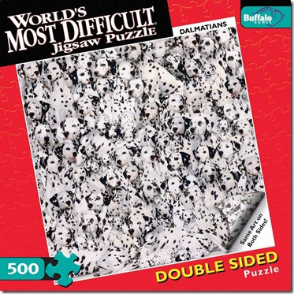

# Reading Day: 06

## Understanding the Problem Domain
Okay, I had another 'a-ha' moment while reading this article.
I understand why learning Javascript is so challenging. The problem domain
is about understanding the bigger picture of programming: What is it trying to acheive?
Once that is clear then writing code becomes easier and less abstract.

I had never heard of a problem domain before. It changes my perspective learning javascript.

## Objects
Objects group together a set of variables and functions. In an object, **Variables** become known as properties and functions become known as **Methods**

**In an Object**

*Functions = Methods*

*Variables = Properties*

When setting properties, you treat the values like you would do for variable strings 'like in quotes'. Functions [like in brackets].

You can access the properties or methods of an object using dot notation. You can also access properties using **[square brackets]**

I'm glad to have had the weekend to read this section. There is quite a bit of information and I found that I'm beginning to understand the concepts more easily.

## (DOM) Document Object Model
(DOM specifies how browsers should create a model of an HTML page and how it can access and update the contents of a web page while it's in the browser.

The DOM is called an object model because it is made up of objects. DOMs are also referred to as and **API** (Application programming interface).

A **Dom tree** is a model of a web page made up of the following **Nodes**:
- Document
- Element
- Attribute
- Text
Each node is an object with methods and properties. Scripts access and update the DOM tree but not the source HTML file. Any changes made to the DOM tree are reflected in the browser.

Accessing and updating the DOM tree involves two steps.

1. Locate the node that represents the element you want to work with.
1. Use it's text content, child elements and attributes. 
There are several ways to access the elements:
**DOM Queries** and **Traversing the DOM**. 

## DOM Queries

What I currently understand is that DOM queries use getElements and traversing uses previousSybling / nextSybling.
Methods that find elements in the DOM tree are called DOM queries.

When you need to work with an element more than once you should use a variable to store the query result. This is called **Caching the Selection**.

DOM queries may return one element or return a **Nodelist**.
A nodelist is collection of nodes.

At this point of my writing I must say that I'm beginning to grasp these concepts and not just copying out of the book. Going back to the Problem Domain article I find much of Javascript to be like the 2 sided dalmation puzzle. 

Methods that return a single element node area:

- getElementById ('id')
- querySelector ('css selector')

Methods that return one or more elements are called a **Nodelist**
Here are some examples:

- get elementByClassName ('class')
- get elementByTagName ('tag name')
- querySelectorAll ('css selector')

So after reading about how javascript interacts with css tags really blew me away. This whole DOM model was a (going back to the puzzle analogy) piece that connected two concepts together. And I had no idea beforehand how css and javascript could be connected. My javascript universe just expanded. 

## Nodelist
A nodelist is a DOM query that returns more than one element. These lists are similar to an array. Each node is given and index number that starts with zero.

Although nodelists look like arrays and numbered like an array, they are a type of object called a collection.

## Nodelist Properties
Properties include **Length** and **Item**. You can use parenthasis or square brackets in the syntax to retrieve an item from an nodelist.

An element from a nodelist can be selected using:
- Class attributes
- Tag Names
- CSS Selectors

Again, my understanding has expanded. The more I learn, the less I know. But as Schoolhouse Rock says "Knowledge is Power".

## Updating Element Content
When you use these properties to update the content the new content will overwrite the entire contents of the element. And the web page content can be changed.

## Adding or Removing HTML Content
There are two different approaches to removing content. The first one is called using the innerHTML property . New content is provided as a string in a variable.

To remove content you must set innerHTML to an empty string. To remove one element you need to provide the entire fragment minus that element.

## DOM maniputation methods 
DOM manipulation methods are safer than using InnerHTML. To add content, you use a Dom method to create content one node at a time. You can remove content by using a single method.

## Attribute Nodes
You can use other properties and mothods on that element node to access and change its attributes throught:
- getAttribute ()
- hasAttribute ()
- setAttribute ()
- removeAttribute ()

The hasAttribute () method checks to see if the element has a class attribute.

## DOM in a Chrome Browser
Toe examine the DOM using a Chrome Browser, you view the properties panel.

[<== Back to Table of Contents](index.md)