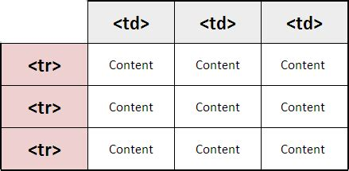

# Reading Day: 07

# Document Modeling
Document Modeling is the process of creating a comceptual model in code for a specific problem.
This is done by resarching and defining relevant properties that help you measure metrics. This article is a bit abstract for me. What I can understand is a comparison to an Epic Fail video and how data can be collected and used.

## Object Oriented Programming
1. The **'new'** keyword instantly creates an object.

2. The **Constructor** function initializes properties inside that object using the **'this'** variable.

3. The object is stored in the variable for later use.

A domain model that's articulated well can verify and validate you understanding of the problem. 

Honestly I felt this blog article was hard to follow. **The example of the problem domain was not very clear.**

# HTML Tables
A table represents information in a grid format. HTML tables are built using a **table** element. Table **rows** allow you to build rows. Table data is what goes inside the table.

A table is made up of 3 main parts.

- Table Head
- Table Body
- Table Foot

## Old Code

Old code that should not be used anymore includes inline styling of table cells using the width, borders and colors. All table styling should be done with CSS.

## Objects 
The **'new'** keyword and the object constructor create a bland object which you can add properties and methods to an object. 

You can create an empty object using literal notation. **(example)** var hotel = {}

To update the value of properties, **dot notation** or **square brackets** are used. I'm getting the references from class.

Object constructors can use a funtion as a template for creating objects by creating a template with the objects properties and methods.

Again, I should mention that I'm fulfilling a reading assignment. These concepts are new and abstract. I hope to make better sense of them in the lecture tomorrow. 

## new
More on objects... To create instances of the object, the **constructor function** is used. The **'new'** keyworkd is followed by a call to the function creates a new object.

## this
The **'this'** keyword is used instead of the object name to indicate that the property or method belongs to the object that this fuction creates. Objects can be created through the following ways:
**Literal Notation** and 
**Object Constructor Notation**. 

## Storing Data
Data can be stored in the following:
- Variables
- Arrays
- Individual Objects
- Multiple Objects

## Arrays are objects?

Okay, this is new. What I now know is that an array holds a related set of key value pairs, but the key for each value is it's index.

## Built in Objects

Browsers come with a set of built-in objects that represent thingslike the browser window. These built in objects act like a toolkit for creating interactive web pages.

**There are 3 main tools**
1. Browser Object Model
1. Document Object Model
1. Global Javascript Objects

The three sets of tools each offer a different range of tolls that help jyou write scripts for web pages.

## The browser object model: The window object
This represents the current browser window or tab. It contains other objects that tell you about the browser including current URL, the distance the document has been scrolled and window history.

## The DOM Document
This model creates a **graphic representation of the web page elements**. The DOM will list information about the page including: **Page Title**, and **Date Created of Modified**. 

## Global Objects
The names of global objects represent data types.

- String
- Number
- Boolean

## Data Types
In javascript ther are six data types. The first 5 of them are described as simple (primitive) data types. The sixth is the **object** and described as a complex data type.

1. String
1. Number
1. Boolean
1. Undefined 
1. Null
1. Object

Reading about the data types this time was a good reminder and helped me recall and think about how they have been referenced over the past week.

Honestly, Global object confused me a bit. Although breaking down the categories made it more simple. Perhaps I was overthinking it>
- Number Object
- Math Object
- Date and Time Objects

Global functions are used to do math, retrieve date and time, and check number values.

FINE

[<== Back to Table of Contents](index.md)